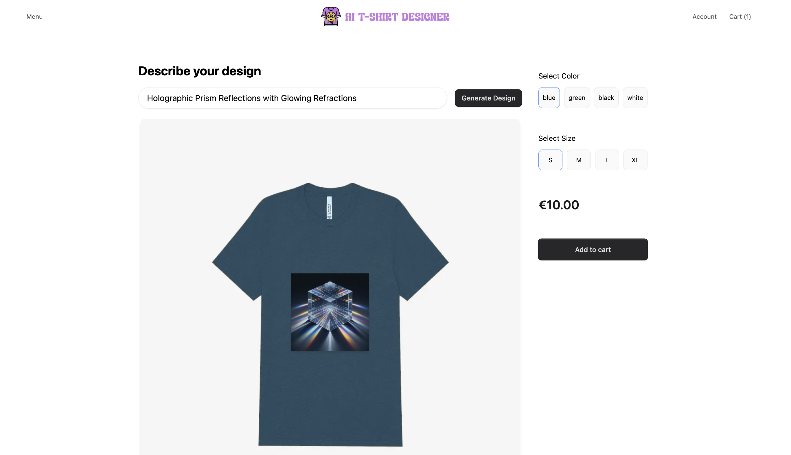

# Medusa v2 Example: Personalised Product



## Features

- **AI Image Generation Integration**  
  Seamlessly integrates with an AI-powered image generator to create custom designs for products. Requires OpenAI key to me set in .env file.

- **Custom Endpoints for Design Management**  
  Bespoke endpoints to create and showcase popular designs, offering flexibility and control over design presentation.

- **Custom Product Details with Order Metadata**  
  Utilizes order metadata to provide fully customized product details for each customer, ensuring personalized experiences.

- **Print-on-Demand Fulfillment Integration Example**  
  Example integration with print-on-demand fulfillment services, enabling easy handling of orders and product delivery.

- **Admin UI Widget for Design Management**  
  An intuitive admin UI widget allows easy access and management of designs, making them viewable on the order page for administrators.


## Installation

1. Clone the repository and change to the `medusa-personalised-products-example` directory:

```bash
git clone https://github.com/james-a-rob/medusa-personalised-products-example.git
cd medusa-personalised-products-example
```

2\. Rename the `.env.template` file to `.env` in medusa dir.

3\. If necessary, change the PostgreSQL username, password, and host in the `DATABASE_URL` environment variable.

4\. Install dependencies in both medusa and storefront dirs:

```bash
yarn # or npm install
```

5\. Setup and seed the database in medusa dir:

```bash
npx medusa db:setup
yarn seed # or npm run seed
```

6\. Start  both medusa and storefront apps:

```bash
yarn dev # or npm run dev
```

